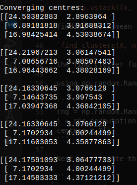
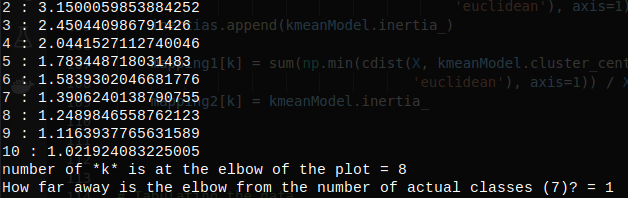
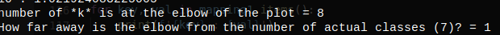

### Machine Learning - The k-means algorithm

Implementing the K-means clustering algorithm on the 4 dimensional, 3 dimensional csv dataset:

## The Code:

``
    def read_csv():
        x = []
        y = []
        labels = []
        x_label = ""
        y_label = ""
        with open('../csc/aggregation.csv') as csvfile:
            reader = csv.reader(csvfile, delimiter=',')
            lines = 0

            #iterate through each row in aggregation.csv and append to it's respective label i.e list
            for row in reader:
                if lines >= 1:
                    print(', '.join(row))
                    x.append(float(row[1]))
                    y.append(float(row[2]))
                    labels.append(row[0])
                    lines += 1
                else:
                    x_label = row[1]
                    y_label = row[2]
                    print(', '.join(row))
                    lines += 1
    return x, y, x_label, y_label, labels
``

The k-mean clustering algorithm
``
#combine x and y into a 2D list of (x, y) pairs
X = np.vstack((x, y)).T
print(X)

def find_clusters(X, n_clusters, rseed=2):
    # choose clusters randomly
    rng = np.random.RandomState(rseed)
    i = rng.permutation(X.shape[0])[:n_clusters]
    centers = X[i]

    # This loop continues until convergence.
    # You could make it run a set number of times by changing
    # it to say while x > 5, for example, and removing the break
    print("\nConverging centres:")
    while True:
    # using the pairwise_distances_argmin method to
        # calculate distances between points to centres
        labels = pairwise_distances_argmin(X, centers)

        # 2b. Find new centers from means of points
        new_centers = np.array([X[labels == i].mean(0) for i in
        range(n_clusters)])

        # 2c. Check for convergence
        if np.all(centers == new_centers):
            break
        centers = new_centers

        # Print centres of convergence
        print(centers)
        print()

    return centers, labels

    centers, labels = find_clusters(X, 3)

plt.scatter(X[:, 0], X[:, 1], c=labels, s=50, cmap='viridis')
plt.title('K-Means clustering of aggregation.csv dataset')
plt.xlabel(x_label) # x-axis
plt.ylabel(y_label) # y-axis
plt.savefig("aggregates.png") # save plot image

from sklearn.cluster import KMeans
from sklearn import metrics
from scipy.spatial.distance import cdist

distortions = [] #average of the squared distances from the cluster centers of the respective clusters
inertias = [] #sum of squared differences from the closest mean
mapping1 = {}
mapping2 = {}
K = range(2, 11)

for k in K:
    # Building and fitting the model
    kmeanModel = KMeans(n_clusters=k).fit(X)
    kmeanModel.fit(X)
 
    distortions.append(sum(np.min(cdist(X, kmeanModel.cluster_centers_,
                                        'euclidean'), axis=1)) / X.shape[0])
    inertias.append(kmeanModel.inertia_)
 
    mapping1[k] = sum(np.min(cdist(X, kmeanModel.cluster_centers_,
                                   'euclidean'), axis=1)) / X.shape[0]
    mapping2[k] = kmeanModel.inertia_

    # Tabulating the data
    count = 0
    for key, val in mapping1.items():
        count += 1
        print(f'{key} : {val}')

    print(f"number of *k* is at the elbow of the plot = {count}")
    print(f"How far away is the elbow from the number of actual classes (7)? = {count -7}")
``

## Code Description:

From the code above, we were able to implement the k-mean clustering algorithm for n Number of Clusters, with a data-set of our choosing.

To Read the content of our dataset which is in a csv file, we implemented a `readcsv` method that finds a csv file per the name passed to it as string.
Since our aggregation data-set is a 2D pair of X against Y with their respective labels, we return `x` for rows containing `x` data value and `y` for rows containing the `y` data values. 
The `x_label` and `y_label` are the respective labels for `x and y`.

Next we needed to figure out how to combine our `x and y` data pairs into a bi-dimensional array of x and y data value. 

We get this done using `Numpy arrays`.

Next is the main algorithm for clustering/grouping our given data.
Firstly we randomly choose centre points from our given combination of x and y pairs into a 2dimensional numpy array, stored in `X`;
Then we continue to the main event loop that keeps iterating our Numpy array and assigning new centre points.

The algorithm compares the currently gotten centre to the previously chosen centre points and if their values match, i.e `Convergence`, we exit the loop and return our centres as well as the appropriate clusters. 
Else the event loops continues iterating recursively through the Bi-dimensional array, till a centre that Fits is found.

After obtaining the centres / k-mean of the dataset, we move further to visualize them, using the matplotlib library, 
we title our plot and then label our horizontal and vertical axis with respect to the `x_label` and `y_label` we go from reading our csv file earlier on. We then plot the graph with respect to our 2dimensional numpy array and visualize it in a .png file.

The final part of our code  handles, the number of individual `*k* plot` are in our numpy array should we iterate it `2 through 11` times. We iterate it through that range i.e `2, 11` and compute 
1. The disortions i.e the average of the squared distances from the cluster centers of the respective clusters
2. The inertia i.e the sum of squared differences from the closest mean

we map distinct values into dictionary objects for `mapping1` and `mapping2`, and initialize a counter for the number of `*k*`
plots.

## Code Outputs:

## Observations:
For implementing the k-mean clustering algorithm, i chose python, for it dynamic, powerful/simple to learn syntax, as well as it's massive community support for building data-science/machine learning models.

All the images displayed above are respective outcomes of the algorithm from clustering the data, visualizing them, finding the `k` plots and deriving the difference from the actual number of classes which is 7.

Since task one was a one dimensional dataset, there was no need to combine it's value to a numpy array or similar

## Conclusion 
Running all taskes Task1, Task2 and Task3 respectively yields desired outputs of k-means for their varied data-points and dimensions. 
From the exercises, we can boldly assume k-means clustering algorithms are good for grouping and clustering related chunks in a larger dataset together.
